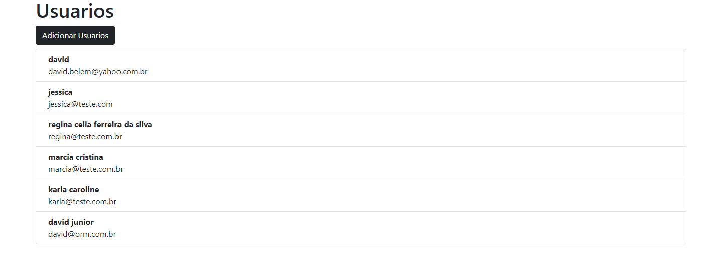
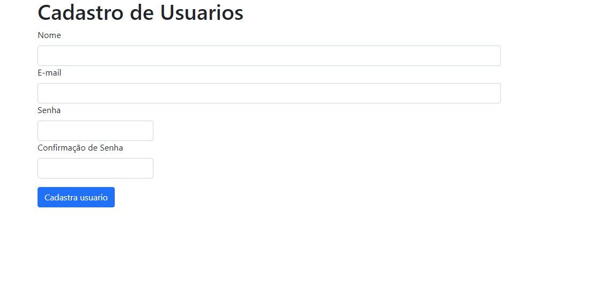

#  Desenvolvedor PHP + Laravel

<br>
  
<br>

<br><br>  

  <br><br>

### Versão Laravel 9.0 
Versão e Docker e git
```sh
Feito banco de dados Sqlite 
```
```sh
Obs: Por motivo curto tempo , não feito no postgree
```


Página de Cadastro (Laravel/Blade):
```sh
• Crie uma página de registro de usuário com os seguintes campos:
• Nome (obrigatório, mínimo de 3 caracteres, máximo de 50 caracteres).
• E-mail (obrigatório, deve ser um e-mail válido).
• Senha (obrigatória, mínimo de 6 caracteres, máximo de 20 caracteres).
• Confirmação de Senha (obrigatória e deve coincidir com a senha).
```


Validações (Laravel):

```sh
• Utilize as ferramentas de validação fornecidas pelo Laravel para validar os
campos do formulário.
• Exiba mensagens de erro apropriadas quando os campos não atenderem às
regras especificadas acima.
```
Validores criados
```sh
No formulario [UsersFormRequest.php]

Na Api [ApiUsersRequest.php]
```


Modelo e Migração (Laravel):
```dosini
• Crie um modelo e uma migração para armazenar os usuários no banco de dados
SQLite.
• Configure a tabela para armazenar as informações dos usuários.
```


API de Back-end (Laravel):
```sh
• Crie uma API RESTful em Laravel para processar o registro de usuários.
• Valide os dados recebidos da solicitação, incluindo a confirmação de senha.
• Armazene os usuários registrados no banco de dados PostgreSQL.
• Retorne uma resposta apropriada para o front-end (por exemplo, sucesso ou
erro) no formato JSON.
```

```sh
Todos os usuarios
GET
http://localhost:8989/api/users/ 
Busca pelo name
http://localhost:8989/api/users/?name=david
busca por id 
http://localhost:8989/api/users/id

cadastro de usuario
POST
http://localhost:8989/api/users/
<head>
name
email
password
[ApiUsersRequest.php] falidar os dados


Login de usuarios
POST
http://localhost:8989/api/login
email: 
senha: 
response : Toker <200>  | Unauthorized <401>
```


Testes Unitários (Laravel/PHP):
```sh
• Escreva pelo menos um teste unitário para a API Laravel para garantir que os
dados sejam validados corretamente e armazenados no banco de dados
PostgreSQL.
• Utilize a ferramenta de teste do Laravel para isso.
```


Tratamento de Erros (Laravel):
```sh
Implemente um tratamento de erro apropriado na API Laravel para lidar com
falhas na comunicação com o front-end.
• Retorne respostas de erro no formato JSON.

UsersFormRequest.php
```


Repositório Público no GitHub:
```sh
https://github.com/Davidmulder/desafiolaravel.git
```


Acesse o projeto
[http://localhost:8989](http://localhost:8989)
